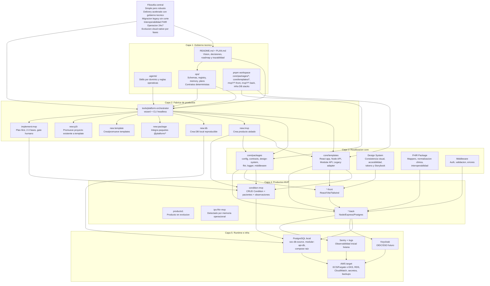
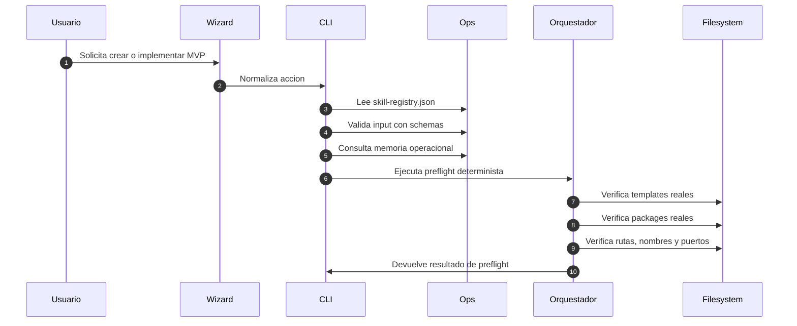
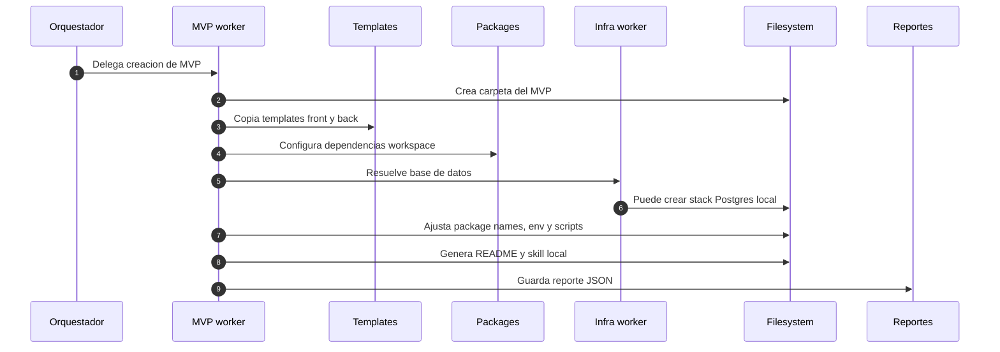
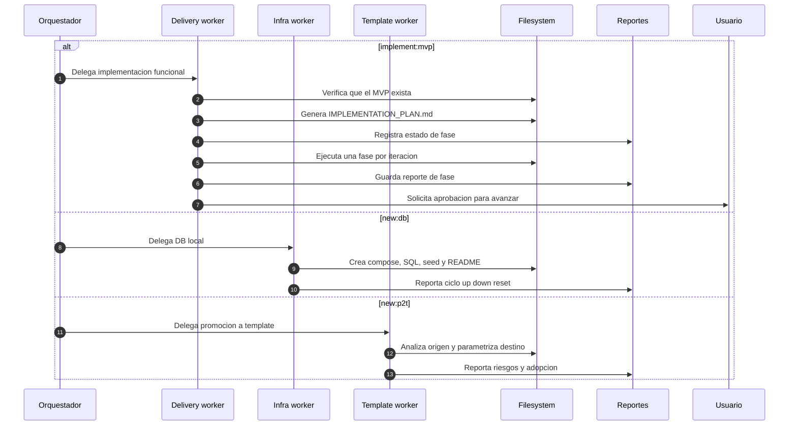
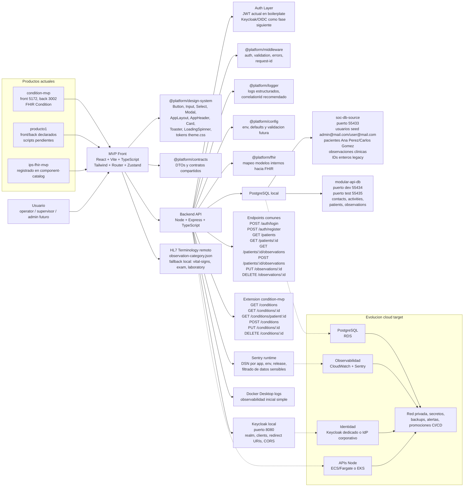

# Graficos de estructura y filosofia del proyecto

Este documento resume la estructura real del repositorio `health-platform-challenge` en cuatro graficos complementarios. La lectura recomendada es:

1. `Mapa estructural del monorepo`: que existe fisicamente en el repo.
2. `Arquitectura por capas y filosofia`: por que esta organizado asi.
3. `Flujo de orquestacion, skills y trazabilidad`: como se crean y evolucionan artefactos.
4. `Flujo runtime de un MVP de salud`: como corre un producto end-to-end.

## 1. Mapa estructural del monorepo

```text
health-platform-challenge/
|
+-- Root de plataforma
|   +-- README.md                         Vision, arquitectura, comandos y roadmap resumido
|   +-- PLAN.md                           Decisiones, contexto, fases y criterios de ejecucion
|   +-- package.json                      Scripts raiz y workspaces declarados
|   +-- pnpm-workspace.yaml               Alcance real del monorepo
|   +-- docker-compose.yml                Postgres raiz y Keycloak local
|   +-- .env.example                      Variables base de plataforma
|
+-- core/                                Nucleo reutilizable y gobernado
|   |
|   +-- packages/                         Paquetes internos consumidos como workspace
|   |   +-- config/                       Configuracion runtime y entorno
|   |   +-- contracts/                    DTOs y contratos compartidos front/back
|   |   +-- design-system/                UI, layout, feedback, hooks, tokens, Storybook
|   |   +-- fhir/                         Helpers, normalizacion y mapeos clinicos FHIR
|   |   +-- logger/                       Logging estructurado y trazabilidad
|   |   +-- middleware/                   Auth, errores, validacion y request-id
|   |
|   +-- templates/                        Boilerplates base para nuevos productos
|       +-- react-app-boilerplate/        React, Vite, TypeScript, Tailwind
|       +-- node-api-boilerplate/         Node, Express, TypeScript, PostgreSQL
|       +-- modular-api-boilerplate/      API por capas con Swagger y testing
|       +-- legacy-adapter-boilerplate/   Adaptacion legacy y migracion progresiva
|
+-- infra/                               Infraestructura local y referencia cloud
|   |
|   +-- local/                            Servicios para desarrollo
|   |   +-- postgres/
|   |   |   +-- soc-db-source/            DB SOC, puerto 55433, seeds clinicos y auth
|   |   |   +-- modular-api-db/           DB modular, puertos 55434 y 55435
|   |   |   +-- init/                     DDL FHIR usado por compose raiz
|   |   +-- keycloak/                     Guia OIDC/SSO local
|   |   +-- sentry/                       Guia de observabilidad runtime
|   |
|   +-- registry/                         Registry privado conceptual
|   +-- aws-target/                       ECS/Fargate o EKS, RDS, CloudWatch, secretos
|
+-- mvp/                                 Productos demostrativos
|   |
|   +-- condition-mvp/                    MVP generado para recurso FHIR Condition
|   |   +-- condition-mvp-front/          React/Vite, pacientes, observaciones, conditions
|   |   +-- condition-mvp-back/           Node/Express, auth, patients, observations, conditions
|   |   +-- .agents/skills/               Skill local de evolucion del producto
|   |
|   +-- producto1/                        Producto en construccion
|   |   +-- producto1-front/              Consume contracts y design-system
|   |   +-- producto1-back/               Consume config, contracts, fhir, logger, middleware
|   |
|   +-- ips-fhir-mvp/                     Registrado en memoria operacional
|
+-- ops/                                 Gobierno headless y trazabilidad
|   +-- skill-registry.json               Mapeo new:* e implement:mvp hacia skills
|   +-- schemas/                          Contratos de entrada y salida
|   +-- examples/                         Configs reproducibles
|   +-- plans/                            Reportes de ejecucion generados
|   +-- component-catalog.json            Memoria de packages, templates, DB stacks y MVPs
|   +-- memory.lock.json                  Control de drift de memoria
|
+-- .agents/                             Skills globales del repositorio
|   +-- skills/platform-orchestrator/      Entrada general, wizard y headless
|   +-- skills/mvp-product-orchestrator/   Provisioning de MVPs
|   +-- skills/mvp-delivery-orchestrator/  Implementacion funcional por fases
|   +-- skills/template-promoter/          Proyecto existente hacia template reusable
|
+-- tools/platform-orchestrator/          Motor ejecutable del gobierno operativo
    +-- cli.js                            CLI headless para new:* e implement:mvp
    +-- wizard-launch.js                  Entrada interactiva desde npm run new
    +-- wizard.js / wizard-ink.mjs        Wizard clasico e Ink TUI
    +-- intent-parser.js                  Inferencia de accion desde texto libre
    +-- memory-refresh.js                 Actualiza component-catalog y memory.lock
```

## 2. Arquitectura por capas y filosofia



## 3. Flujo de orquestacion, skills y trazabilidad

### 3.1 Entrada, contratos y preflight



### 3.2 Provisioning de MVP con new:mvp



### 3.3 Implementacion por fases y otros comandos



## 4. Flujo runtime de un MVP de salud


