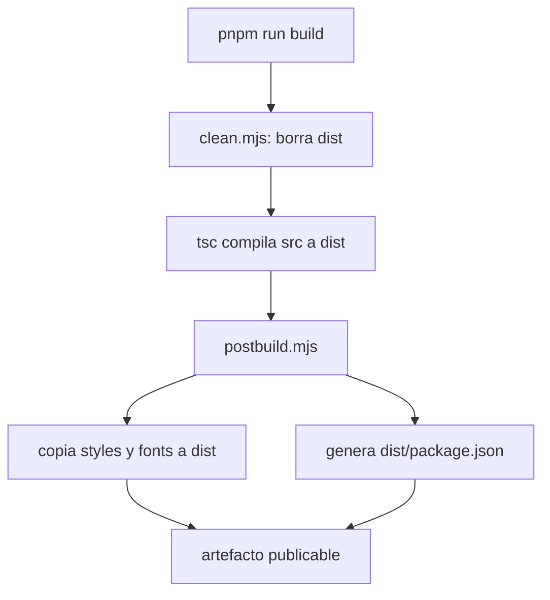
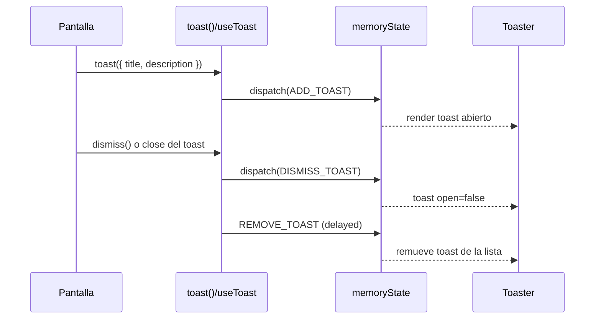

# @platform/design-system

Sistema de diseno compartido del monorepo para aplicaciones React. Este paquete centraliza componentes UI, primitives de layout, feedback de interfaz, hooks y el tema visual para mantener consistencia entre productos.

## Objetivos

- Unificar lenguaje visual y comportamiento de componentes.
- Reducir duplicacion de UI entre `core/templates/*` y `mvp/*`.
- Entregar una base accesible, testeable y extensible.

## Stack tecnico

- React 18 + TypeScript.
- TailwindCSS + tokens CSS variables.
- Radix UI primitives para componentes interactivos.
- Storybook 10 para desarrollo visual y documentacion.
- Vitest + Testing Library + vitest-axe para calidad y accesibilidad.

## Arquitectura del paquete

```mermaid
flowchart LR
  A[Apps consumidoras] --> B[@platform/design-system]
  B --> C[src/ui]
  B --> D[src/layout]
  B --> E[src/display]
  B --> F[src/feedback]
  B --> G[src/hooks]
  B --> H[src/styles/theme.css]
  C --> I[Radix + CVA + Tailwind]
  F --> G
```

## Estructura principal

```text
core/packages/design-system/
  src/
    index.ts
    ui/
      button.tsx
      input.tsx
      select.tsx
      dialog.tsx
      toast.tsx
      scroll-area.tsx
      chip.tsx
      index.ts
    layout/
      app-layout.tsx
      app-header.tsx
      section-banner.tsx
      background.tsx
      index.ts
    display/
      card.tsx
      index.ts
    feedback/
      toaster.tsx
      loading-spinner.tsx
      redirect-screen.tsx
      index.ts
    hooks/
      use-toast.ts
      index.ts
    styles/
      theme.css
    fonts/
      GeistVF.woff
      GeistMonoVF.woff
  .storybook/
  tests/
  scripts/
```

## API publica

El barrel principal `src/index.ts` exporta 5 dominios:

- `ui`: `Button`, `Input`, `Select`, `Modal`, `ScrollArea`, `Chip`, primitives de `Toast`.
- `layout`: `AppHeader`, `AppLayout`, `SectionBanner`, `Background`.
- `display`: `Card`.
- `feedback`: `Toaster`, `LoadingSpinner`, `RedirectScreen`.
- `hooks`: `toast`, `useToast`.

## Tema visual y tokens

El tema vive en `src/styles/theme.css` y define tokens CSS para:

- Superficies: `--background`, `--card`, `--popover`.
- Texto y contraste: `--foreground`, `--muted-foreground`, etc.
- Semantica: `--primary`, `--secondary`, `--warning`, `--error`, `--success`, `--info`.
- Soporte: `--border`, `--input`, `--ring`, `--radius`, `--chart-*`.

Tambien incluye:

- `@font-face` de Geist.
- Variantes `:root` y `.dark`.
- Fondo con gradientes para dar identidad visual base.

La configuracion de Tailwind (`tailwind.config.ts`) mapea colores a esas variables, por lo que los componentes consumen tokens en lugar de colores hardcodeados.

## Build y empaquetado

Script principal:

- `pnpm run build` = `clean` + `tsc` + `postbuild`.

Pipeline:



Artefactos resultantes:

- `dist/index.js`
- `dist/index.d.ts`
- `dist/styles/theme.css`
- `dist/fonts/*`
- `dist/package.json`

## Scripts

- `pnpm run dev`: Storybook en `http://localhost:6006`.
- `pnpm run build`: build de libreria + copiado de assets.
- `pnpm run build-storybook`: build estatico de Storybook.
- `pnpm run test`: tests unitarios (`project=unit`).
- `pnpm run test:watch`: modo watch de Vitest.
- `pnpm run test:coverage`: cobertura (`text`, `html`, `lcov`).
- `pnpm run test:storybook`: tests de stories en navegador headless.
- `pnpm run clean`: elimina `dist`.

## Testing y calidad

- Unit tests con entorno `jsdom`.
- Story tests con plugin `@storybook/addon-vitest` + Playwright Chromium headless.
- Accesibilidad basica con `vitest-axe` (ejemplo en `tests/ui.a11y.test.tsx`).

## Integracion en apps consumidoras

1) Declarar dependencia `workspace:*`.
2) Importar el CSS del tema una sola vez en el entrypoint de la app.
3) Usar componentes y hooks desde el paquete.

Ejemplo:

```tsx
import "@platform/design-system/styles/theme.css";
import { Button, Input, Select, Toaster, toast } from "@platform/design-system";

export function ExampleScreen() {
  return (
    <main className="p-6 space-y-4">
      <Input label="Nombre" placeholder="Juan" />
      <Select label="Estado">
        <Select.Trigger>
          <Select.Value placeholder="Seleccionar" />
        </Select.Trigger>
        <Select.Content>
          <Select.Item value="active">Activo</Select.Item>
          <Select.Item value="inactive">Inactivo</Select.Item>
        </Select.Content>
      </Select>
      <Button onClick={() => toast({ title: "Guardado", description: "Cambios aplicados" })}>
        Guardar
      </Button>
      <Toaster />
    </main>
  );
}
```

## Patrones de implementacion relevantes

- `cn()` combina `clsx` + `tailwind-merge` para resolver clases conflictivas.
- Variantes tipadas con `class-variance-authority` (ejemplo claro: `Button`, `Chip`).
- Componentes compuestos con namespaces (`Modal.*`, `Select.*`, `Input.Container/Label`).
- Primitives Radix para accesibilidad y teclado sin reinventar comportamiento base.

## Flujo de Toast

`use-toast.ts` implementa un store en memoria con reducer y listeners, reutilizable sin dependencia externa.



Notas actuales del comportamiento:

- Limite de toasts simultaneos: `TOAST_LIMIT = 1`.
- Retiro diferido interno: `TOAST_REMOVE_DELAY` elevado (evita remocion inmediata).

## Storybook

- Config en `.storybook/main.ts`.
- Stories detectadas en `../src/**/*.stories.@(ts|tsx|mdx)`.
- Addons activos: docs, a11y y vitest.
- `preview.ts` inyecta `theme.css` y usa layout centrado por defecto.

## Contrato de publicacion

`package.json` define:

- Entrypoint: `dist/index.js`.
- Tipos: `dist/index.d.ts`.
- Export CSS: `@platform/design-system/styles/theme.css`.
- Peer deps: `react` y `react-dom` v18.

## Checklist para agregar componentes nuevos

1. Crear componente en `src/<dominio>/` con tipos fuertes.
2. Usar tokens del tema y `cn()`.
3. Crear `*.stories.tsx`.
4. Exportar desde `index.ts` del dominio y desde `src/index.ts` si aplica.
5. Agregar tests unitarios y, si corresponde, verificacion a11y.
6. Ejecutar `pnpm run test` y `pnpm run build`.

## Comandos rapidos

```bash
pnpm -C core/packages/design-system run dev
pnpm -C core/packages/design-system run test
pnpm -C core/packages/design-system run test:storybook
pnpm -C core/packages/design-system run build
```
